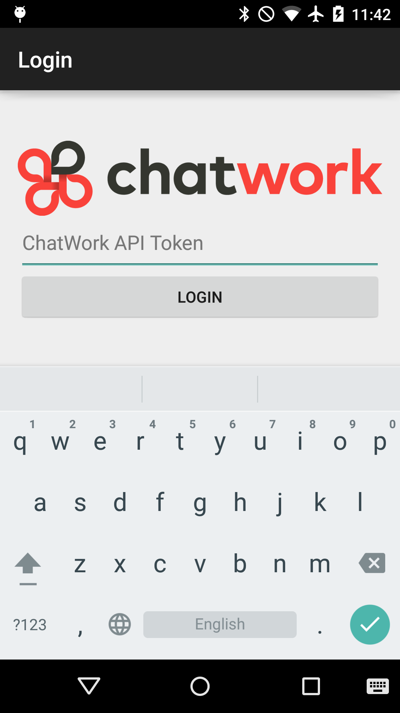
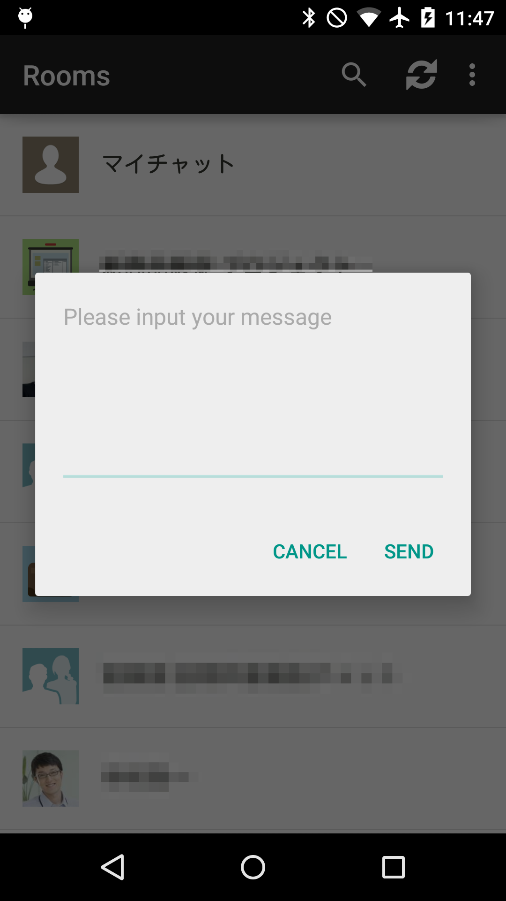

# RealmCW

Sample Android application using Realm and ChatWork API.  
**THIS IS UNOFFICIAL "ChatWork" APPLICATION. You should not be an inquiry into ChatWork Inc.**

## What's this

This is demo application for [Realm Tech Talk #1](http://realm.connpass.com/event/11814/), [#2](http://realm.connpass.com/event/11815/) and [Realm Meetup #1](http://realm.connpass.com/event/12028/).

<table>
<tr>
<td></td>
<td></td>
</tr>
</table>

## How to use

1. [Signup ChatWork](http://www.chatwork.com/)
2. [Send enable request ChatWork API](http://developer.chatwork.com/)
3. Get ChatWork API token
4. Build application and run
5. Input your ChatWork API token and login

## License

### This application

Apache License, Version 2.0

```
Copyright 2015 Ryutaro Miyashita

Licensed under the Apache License, Version 2.0 (the "License");
you may not use this file except in compliance with the License.
You may obtain a copy of the License at

    http://www.apache.org/licenses/LICENSE-2.0

Unless required by applicable law or agreed to in writing, software
distributed under the License is distributed on an "AS IS" BASIS,
WITHOUT WARRANTIES OR CONDITIONS OF ANY KIND, either express or implied.
See the License for the specific language governing permissions and
limitations under the License.
```

### Application libraries

* [Please show this](https://github.com/ryugoo/RealmCW/blob/master/app/src/main/java/com/chatwork/android/realmcw/activities/LicenseActivity.java#L46)